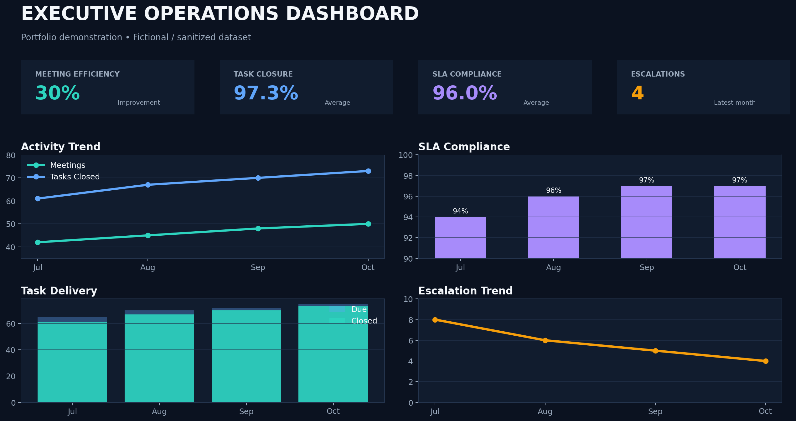

# Kiran Kumar Ambati

### Senior Executive Assistant · Executive Office Management · Operations

📍 Hyderabad, India · 11+ years of professional experience

---

## 👋 Executive Profile

Results-driven **Senior Executive Assistant & Operations Professional** with 11+ years of experience supporting senior management, leadership teams and C-Suite executives.

Experienced in executive calendar management, leadership meetings, travel coordination, MIS reporting, stakeholder communication, operational coordination, documentation and executive follow-through.

I help leadership teams make operations **organized, visible, predictable and execution-focused**.

---

## 💼 Professional Experience

### Neo Prism Solutions LLC
**Senior Executive Assistant & Operations Coordinator**  
*Dec 2023 – Jun 2026*

- Supported Director-level staffing operations, client engagements and vendor coordination across US and India time zones.
- Managed executive calendars, leadership meetings, quarterly reviews and executive offsites.
- Prepared executive reports, dashboards and board-level presentations.
- Coordinated domestic and international travel, itineraries and expense reconciliation.
- Managed confidential executive communications and stakeholder coordination.
- Coordinated onboarding, timesheets, payroll follow-ups and operational trackers.

### Hathway Cable & Data Com Pvt. Ltd.
**Senior Executive Assistant & Operations Coordinator**  
*Aug 2021 – May 2023*

- Provided executive and operational support across Hyderabad, Chennai and Bangalore.
- Managed high-priority escalations, SLA tracking and regional operational activities.
- Developed KPI dashboards, MIS reports and management performance reports.
- Coordinated leadership visits, operational reviews and executive business meetings.
- Managed vendor coordination, travel logistics and cross-functional follow-ups.
- Supported process improvement and operational efficiency initiatives.

### Reliance SMSL Ltd.
**Sr. Executive Assistant**  
*Sep 2018 – Jul 2021*

- Supported leadership through executive communication, scheduling and operational coordination.
- Coordinated events, travel, employee schedules and performance tracking.
- Served as SPOC between customers, operations, sales and other functional teams.
- Prepared productivity reports and tracked weekly, monthly and quarterly objectives.
- Supported team performance, training and operational planning.

### Hathway Cable & Data Com Pvt. Ltd.
**L2 Sr. Executive Customer Support**  
*Aug 2014 – Aug 2018*

- Managed customer escalations and service operations.
- Supported team performance monitoring and management reporting.
- Coordinated root-cause analysis and process improvement activities.
- Prepared operational metrics and performance reports for senior management.

---

## 🧠 Executive Support Operating Model

**Request → Prioritize → Coordinate → Execute → Report → Close**

---

## 📈 Portfolio Dashboard

> Metrics shown in the portfolio are fictional/sanitized examples created for professional demonstration.

---

## 🗂️ Featured Portfolio

| Portfolio | Focus |
|---|---|
| 📌 [Executive Assistant Portfolio](https://github.com/kiranat232-EA/executive-assistant-portfolio) | Executive support operating model |
| 📅 [Calendar Management](https://github.com/kiranat232-EA/executive-calendar-management) | Scheduling and prioritization |
| ✈️ [Travel Management](https://github.com/kiranat232-EA/executive-travel-management) | Itineraries and logistics |
| 📊 [MIS Reporting](https://github.com/kiranat232-EA/mis-reporting-dashboard) | KPI and management reporting |
| 📝 [Meeting Management](https://github.com/kiranat232-EA/executive-meeting-management) | Agenda, MOM and action tracking |
| ⚙️ [Operations Management](https://github.com/kiranat232-EA/executive-operations-management) | SLA, KPI and escalation tracking |
| 📑 [Document Management](https://github.com/kiranat232-EA/executive-document-management) | Records and version control |
| 🔄 [Process Improvement](https://github.com/kiranat232-EA/process-improvement) | Workflow optimization |
| ✉️ [Executive Communication](https://github.com/kiranat232-EA/executive-communication-management) | Professional correspondence |
| 📗 Advanced Excel | Excel, Pivot Tables, VLOOKUP/XLOOKUP & dashboard practice |
| 💰 [Expense & Budget Management](https://github.com/kiranat232-EA/executive-expense-budget-management) | Expense tracking, budget control & variance analysis |

---

## 🛠️ Tools & Skills

**Microsoft 365:** Excel · Word · PowerPoint · Outlook · Teams

**Collaboration:** Zoom · Google Workspace

**Executive Support:** Calendar Management · Meeting Management · Travel Management · Expense Management · Documentation

**Operations:** MIS · KPI Tracking · SLA Monitoring · Vendor Coordination · Escalation Management

**Reporting:** Pivot Tables · VLOOKUP/XLOOKUP · Dashboards · Management Presentations

---

## 🏆 Selected Professional Highlights

- Supported senior leadership and C-Suite executives across fast-paced operational environments.
- Coordinated multi-location leadership operations across Hyderabad, Chennai and Bangalore.
- Developed KPI dashboards and MIS reporting frameworks for management decision-making.
- Supported domestic and international executive travel.
- Managed confidential leadership communications and executive stakeholder coordination.
- Coordinated meetings, MOMs, action trackers and leadership follow-ups.

---

## 📊 Portfolio Demonstrations

The repositories in this profile demonstrate practical executive-office workflows including:

**Calendar → Meetings → Communication → Travel → MIS → Documents → Operations → Process Improvement → Expense & Budget Management**
All portfolio datasets, dashboards and templates are fictional/sanitized examples created for professional demonstration.

---

## 🎯 Career Focus

Open to opportunities in:

- Senior Executive Assistant
- Executive Assistant
- Executive Office / Executive Operations
- C-Suite Support
- Executive Operations Coordinator
- Management / Leadership Support

---

## 📫 Contact

**Kiran Kumar Ambati**

📍 Hyderabad, Telangana, India  
📧 kiranat232@gmail.com  
📱 809-996-0020

---
