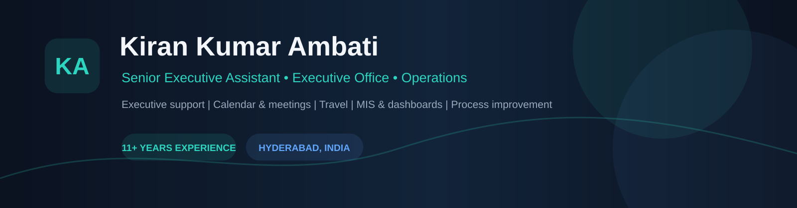
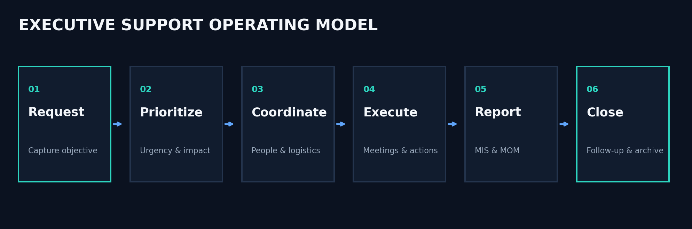

# Kiran Kumar Ambati

### Senior Executive Assistant · Executive Office Management · Operations

**Hyderabad, India** · **11+ years of experience**

---

## 👋 Executive Profile

Results-driven **Senior Executive Assistant & Operations Professional** with **11 years of experience** supporting senior management and C-Suite executives.

I help leadership teams make operations **organized, visible, predictable and execution-focused** — covering calendar strategy, executive meetings, travel, MIS reporting, stakeholder coordination and follow-through.

## 📈 Portfolio Dashboard

> Metrics shown are fictional portfolio data created to demonstrate reporting capability.

## 🧠 Executive Support Operating Model

**Request → Prioritize → Coordinate → Execute → Report → Close**

## 🗂️ Featured Portfolio

| Portfolio | Focus |
|---|---|
| 📌 [Executive Assistant Portfolio](./executive-assistant-portfolio) | Executive support operating model |
| 📅 [Calendar Management](./executive-calendar-management) | Scheduling and prioritization |
| ✈️ [Travel Management](./travel-management) | Itineraries and logistics |
| 📊 [MIS Reporting](./mis-reporting-dashboard) | KPI and management reporting |
| 📝 [Meeting Management](./executive-meeting-management) | Agenda, MOM and action tracking |
| ⚙️ [Operations Management](./operations-management) | SLA, KPI and escalation tracking |
| 📑 [Document Management](./document-management) | Records and version control |
| 🔄 [Process Improvement](./process-improvement) | Workflow optimization |
| ✉️ [Executive Communication](./executive-communication) | Professional correspondence |
| 📗 [Advanced Excel](./advanced-excel-portfolio) | Excel and dashboard practice |

## 🛠️ Tools & Skills

**Microsoft 365:** Excel · Word · PowerPoint · Outlook · Teams  
**Collaboration:** Zoom · Google Workspace  
**Operations:** MIS · KPI Tracking · SLA Monitoring · Vendor Coordination  
**Executive Support:** Calendar · Meetings · Travel · Expenses · Documentation  
**Reporting:** Pivot Tables · VLOOKUP/XLOOKUP · Dashboards · Management Presentations

## 🏆 Selected Highlights

- Improved executive meeting efficiency by **30%** through optimized scheduling workflows.
- Coordinated leadership operations across **Hyderabad, Chennai and Bangalore**.
- Developed KPI dashboards and MIS reporting frameworks.
- Supported domestic and international executive travel.
- Managed confidential leadership communications and executive stakeholder coordination.

## 📊 Excel Dashboard

The portfolio includes **Kiran_Executive_Operations_Dashboard.xlsx** with dashboard, KPI data, task tracker and calendar planning sheets.

## 🔐 Portfolio & Confidentiality

All datasets, dashboards and templates are **fictional/sanitized examples** created for professional demonstration.

## 📫 Contact

**Kiran Kumar Ambati**  
📍 Hyderabad, Telangana, India  
📧 **kiranat232@gmail.com**  
📱 **809-996-0020**

> Open to Executive Assistant, Senior Executive Assistant, Executive Office, Operations Coordinator and similar leadership-support opportunities.
